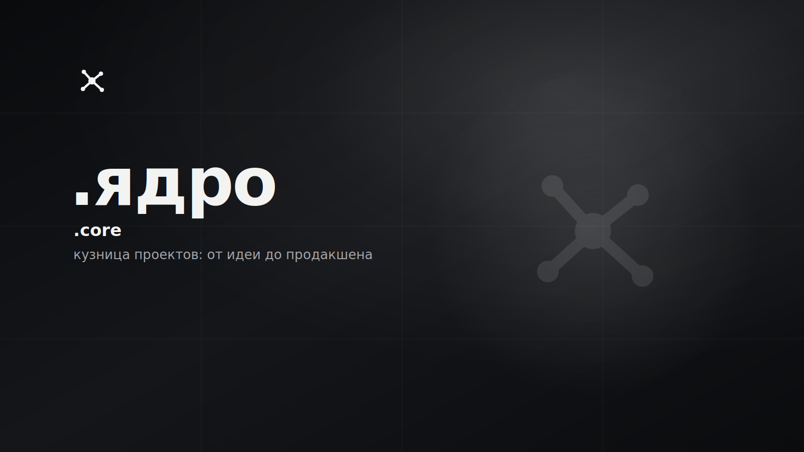

# .core / .ядро

<p>
  
  
  
  <!-- loc:start --><!-- loc:end -->
</p>



<!-- audit:start -->
<p>
  <a href="docs/audit/latest.md"></a>
  <a href="docs/audit/2026-07-02-onyx-sentinel.md"></a>
</p>
<!-- audit:end -->

Персональный портфолио-сайт под брендом **DotCore**: витрина продуктов, которые автор доводит от идеи до продакшена (DotSound, DotLearn, DotAgents, DotWorkBot, DotMathBot, DotTraceIP). Сайт статический (Astro SSG, ноль рантайм-фреймворков): интерактив - точечный vanilla-JS, всё уважает `prefers-reduced-motion`. Личные данные не лежат в репозитории - они приходят из `.env` с Zod-валидацией на build-time, а на CI материализуются из GitHub Actions secrets.

В UI бренд **никогда** не пишется как «DotCore»: только `.core` (EN) или `.ядро` (RU). `DotCore` живёт лишь в коде, репозитории и метаданных.

## Что внутри

- **6 продуктов на витрине**: dotsound, dotlearn, dotmath, dotagents, dotworkbot, dottraceip. Каждый - JSON в `src/content/projects/`, порядок задаёт `FEATURED_ORDER` в `src/lib/projects.ts`. Плюс лёгкий infra-тир (`dotcore-skills`, `tier: "infra"`) - карточка со ссылкой в репозиторий, без case-страницы и вехи в таймлайне.
- **Case-страницы**: у каждого проекта-продукта детальная страница (`/projects/<slug>`) с интерактивной signature-визуализацией, диаграммой архитектуры, таймлайном и разбором инженерных решений.
- **Две локали**: русский (дефолт, без префикса) и английский (`/en`), зеркальные маршруты, авто-детект `navigator.language` → `localStorage` → toggle.
- **Монохромная система**: токены в `src/styles/tokens.css`, near-black + лента серых + off-white, единственный «акцент» - белый свет.
- **Конфиг как контракт**: Zod-схема в `src/lib/config.ts` валидирует env на билде; отсутствие обязательной переменной валит сборку, опциональные деградируют в UI (нет фото - монограмма, пустая соцсеть - ссылка не рендерится).
- **SEO и видимость для ИИ**: canonical + полный hreflang (ru/en/x-default) на каждой странице, JSON-LD-граф (Person, WebSite, ProfilePage, SoftwareSourceCode, BreadcrumbList), sitemap с `lastmod` из git-дат, `llms.txt` + `llms-full.txt` (машиночитаемый индекс и досье проектов для AI-агентов), явные allow-группы AI-краулеров в robots.txt, PNG OG-превью 1200x630, кастомная 404.

## Запуск

```bash
nvm use            # Node 20 LTS (.nvmrc)
npm install
git config core.hooksPath .githooks   # secret-guard перед коммитом
cp .env.example .env   # заполни своими данными
npm run dev        # http://localhost:4321
```

Сайт работает и без `.env`: Zod-схема подставит дефолты, UI плавно деградирует. Заполни переменные, чтобы появились имя, фото, соцсети и ссылки на репозитории проектов.

## Команды

| Команда                | Назначение                                                        |
| ---------------------- | ----------------------------------------------------------------- |
| `npm run dev`          | dev-сервер Astro с HMR (`:4321`)                                  |
| `npm run build`        | production-билд в `dist/`                                         |
| `npm run preview`      | локальный preview собранного `dist/`                              |
| `npm run type-check`   | `astro check` + `tsc --noEmit`                                    |
| `npm run lint`         | ESLint, падает на любом warning                                   |
| `npm run lint:fix`     | ESLint с авто-фиксом                                              |
| `npm run format`       | Prettier write по `ts/tsx/astro/css/json/md`                      |
| `npm run format:check` | Prettier check без записи                                         |
| `npm run og:render`    | PNG из SVG-исходников OG/иконок (`@resvg/resvg-js`)               |
| `npm run seo:check`    | og-freshness (хэш-манифест) + SEO-смок по `dist/` (после `build`) |

## Стек

<p>
  
  
  
  
  
  
  
</p>

Без UI-фреймворка в рантайме (`integrations: []`): только `.astro` + точечный vanilla-JS. Шрифты selfhosted через `@fontsource-variable` (Bricolage Grotesque + Inter).

## Конфигурация

Все личные данные живут в `.env` (gitignored). Имена переменных - в Zod-схеме `src/lib/config.ts`.

- `PUBLIC_*` (`PUBLIC_DOMAIN`, `PUBLIC_GITHUB_USER`, `PUBLIC_AUTHOR_NAME_RU/EN`, `PUBLIC_SOCIAL_*` и др.) попадают в bundle и видны посетителю - по дизайну.
- `AUTHOR_EMAIL` - без префикса, поэтому не уходит в bundle как plain-text `mailto:`/строка. На билде кодируется в base64 от перевёрнутой строки (атрибут `data-e`) и декодируется на клиенте по клику. Это обфускация от наивных скраперов, а не сокрытие: адрес тривиально восстановим в браузере, считай его фактически публичным.
- Приватное фото кладётся в `public/people/` (gitignored); на CI подтягивается из секрета по URL.

Не коммить `.env`. Шаблон переменных - в `.env.example`.

## Деплой

Co-hosted за общим фронт-Caddy: сервер уже держит Docker-стек **DotSound**, чей Caddy занимает порты 80/443. Портфолио развёрнуто как контейнер `caddy:2-alpine` во внешней docker-сети `dotsound` (`deploy/docker-compose.yml` + `deploy/Caddyfile.container`) и наружу порты не публикует - фронт-Caddy DotSound проксирует на него по имени контейнера (`portfolio:80`). Подробности и шаги подключения - `deploy/README.md`. `deploy/setup.sh` - разовая сборка `dist/` на хосте и подъём контейнера, `deploy/update.sh` - `git pull` → пересборка → контейнер сразу отдаёт свежий `dist/` (bind-mount, без пересоздания). GitHub Actions (`.github/workflows/deploy.yml`) на `push` в `main`: gate (`lint` → `type-check` → `build` → `seo:check`), затем по SSH запускает `deploy/update.sh` (доступ настраивается один раз через `deploy/ci-setup.sh`). `pull_request` - только gate, без деплоя. `deploy/harden.sh` в этой схеме не используется (анти-флуд правила задели бы порты DotSound); `deploy/Caddyfile.tmpl` - легаси прежней self-hosted схемы (свой Caddy на хосте).

## Архитектура

Статический сайт на Astro: контент-driven, без рантайм-фреймворков. Страницы и компоненты - `.astro`; данные проектов и переводы - типизированный JSON, загружаемый через Vite `import.meta.glob`. Конфигурация валидируется Zod один раз при импорте модуля, поэтому невалидная среда роняет билд, а не прод.

```
DotBioSite/
├── src/
│   ├── pages/              # роутинг: index + /en + /projects/[slug] + 404 + robots/sitemap/llms.txt
│   ├── layouts/            # BaseLayout
│   ├── components/         # .astro: hero, projects, case/*, diagram/*, illustration/*
│   ├── content/
│   │   ├── projects/       # 7 JSON-описаний проектов (6 product + 1 infra)
│   │   └── i18n/           # ru.json / en.json
│   ├── styles/             # tokens.css, global.css, glass.css
│   └── lib/                # config (Zod), i18n, projects, contacts
├── public/                 # favicon, OG (SVG-исходники + PNG), manifest, _headers, обложки проектов
├── scripts/                # parse-lh.cjs, render-og.mjs (SVG -> PNG), seo-smoke.mjs + check-og-fresh.mjs (CI)
├── deploy/                 # docker-compose.yml + Caddyfile.container (co-hosted), setup.sh/update.sh/ci-setup.sh
├── .github/workflows/      # deploy.yml (gate + SSH-триггер update.sh) + security.yml
└── astro.config.mjs
```

- **Бренд в UI** - только `.core` / `.ядро`, никогда «DotCore».
- **Static-first**: `integrations: []`, ноль рантайм-фреймворков; интерактив - vanilla-JS, всё под `prefers-reduced-motion`.
- **Конфиг через Zod**: обязательная env отсутствует → билд падает; опциональная → graceful fallback в UI.
- **Контент - данные**: проекты и переводы в `src/content/*`, типы и порядок витрины в `src/lib/projects.ts`.
- **i18n**: `ru` (дефолт, без префикса) + `en` (`/en`), зеркальные страницы.
- **Секреты**: только в `.env` / GitHub Actions secrets; приватные ассеты в gitignored `public/people/`.

## Лицензия

© 2026 DotCore. Все права защищены.

Проприетарный код. Использование, копирование, изменение и распространение запрещены без письменного разрешения автора. Исходный код открыт только для ознакомления. См. [LICENSE](LICENSE).
